# AWS VPC Private Subnet Deployment with ALB and Auto Scaling

A production-style AWS setup where the web application runs on EC2 instances in **private subnets** with no public IP. Users reach it only through an **Application Load Balancer** in the public subnets.

**Region:** ap-south-1 (Mumbai)

### Demo video: [Watch on YouTube](https://youtu.be/m_M5Wf2LK78)
[](https://youtu.be/m_M5Wf2LK78)
## Architecture

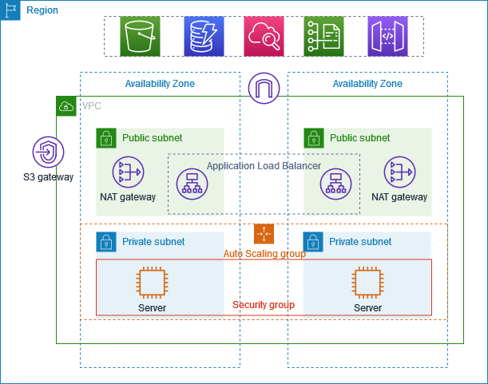

This follows the AWS-recommended pattern for hosting web applications in private subnets. The diagram is from the AWS documentation. I built the same architecture in my own account.

## Problem statement

An application server with a public IP is exposed to the internet. Anyone can scan it and try to attack it. A single server in one data center also goes down if that data center fails.

This project solves both problems:

- The servers sit in private subnets, so the internet cannot reach them directly.
- The servers run in 2 Availability Zones, so one zone failing does not take the app down.
- An Auto Scaling Group replaces failed instances and adds more under load.

## What I built

| Component | Configuration |
|---|---|
| VPC | `aws-production-vpc`, 10.0.0.0/16 |
| Availability Zones | ap-south-1a and ap-south-1b |
| Public subnets | 10.0.0.0/20 (1a), 10.0.16.0/20 (1b) |
| Private subnets | 10.0.128.0/20 (1a), 10.0.144.0/20 (1b) |
| Internet Gateway | 1, attached to the public route table |
| NAT Gateways | 2, one per AZ, each with an Elastic IP |
| Route tables | 1 public, 2 private (one per AZ) |
| Launch template | t3.micro, Ubuntu, key pair for SSH |
| Auto Scaling Group | Desired 2, min 2, max 4, spread across both private subnets |
| Target group | HTTP on port 8000, health checks enabled |
| Load balancer | Application, internet-facing, listener HTTP:80 forwarding to the target group |
| Bastion host | 1 EC2 in a public subnet, used only to SSH into private instances |

## Traffic flow

1. A user opens the ALB DNS name in the browser (port 80).
2. The ALB, placed in the public subnets, picks a healthy target.
3. The ALB forwards the request to a private EC2 instance on port 8000.
4. The instance replies through the ALB.
5. When an instance needs the internet (for example, `apt update`), the request goes out through the NAT Gateway in its own AZ.

## Steps I followed

### 1. Create the VPC

Used **VPC and more** in the console.

- 2 AZs, 2 public subnets, 2 private subnets
- 1 NAT Gateway per AZ
- VPC endpoints: none

AWS created the Internet Gateway, route tables and subnet associations automatically.

### 2. Create the launch template and Auto Scaling Group

- Launch template `aws-production`: Ubuntu AMI, t3.micro, key pair, security group `aws-server`
- Auto Scaling Group `aws-production`: both private subnets, desired 2, min 2, max 4
- Result: 2 instances launched, 1 per AZ, with no public IPv4 address

### 3. Set up the Bastion host

Private instances have no public IP, so I launched 1 EC2 instance in a public subnet with a public IP and SSH allowed.

```bash
# Copy the key to the bastion host
scp -i aws-login.pem aws-login.pem ubuntu@<BASTION_PUBLIC_IP>:/home/ubuntu/

# If using Windows, Use MobaXTerm and drag & drop the .pem file into SFTP panel inside /home/ubuntu/
```

```bash
# SSH into the bastion host
ssh -i aws-login.pem ubuntu@<BASTION_PUBLIC_IP>

# From the bastion host, SSH into a private instance
ssh -i aws-login.pem ubuntu@<PRIVATE_INSTANCE_IP>
```

> Never commit the `.pem` file to GitHub. Add `*.pem` to `.gitignore`.

### 4. Deploy the application

On each private instance, I created an `index.html` and started a Python web server on port 8000.

```bash
cat <<EOF > index.html
<!DOCTYPE html>
<html>
<head><title>HTML Basics</title></head>
<body>
  <h1>Welcome to Application</h1>
  <p>This is a sample web application to demonstrate hosting app in AWS private subnet using AWS Virtual Private Cloud</p>
</body>
</html>
EOF

python3 -m http.server 8000
```

On the second instance, the heading says **Welcome to Application 2**, so I can see which server answered.

### 5. Create the target group and ALB

- Target group `aws-production`: type Instance, HTTP, port 8000, both private instances registered
- Load balancer `aws-production`: Application, internet-facing, both public subnets, listener HTTP:80 forwarding to the target group
- ALB security group: allows HTTP 80 from `0.0.0.0/0`

### 6. Test

Open `http://<ALB_DNS_NAME>` and refresh several times. The page switches between **Application** and **Application 2**, which shows the ALB is spreading requests across both AZs.

## Screenshots

### VPC resource map
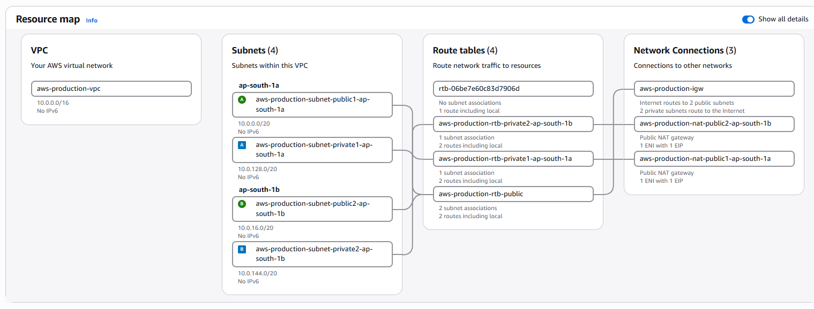

### Subnets
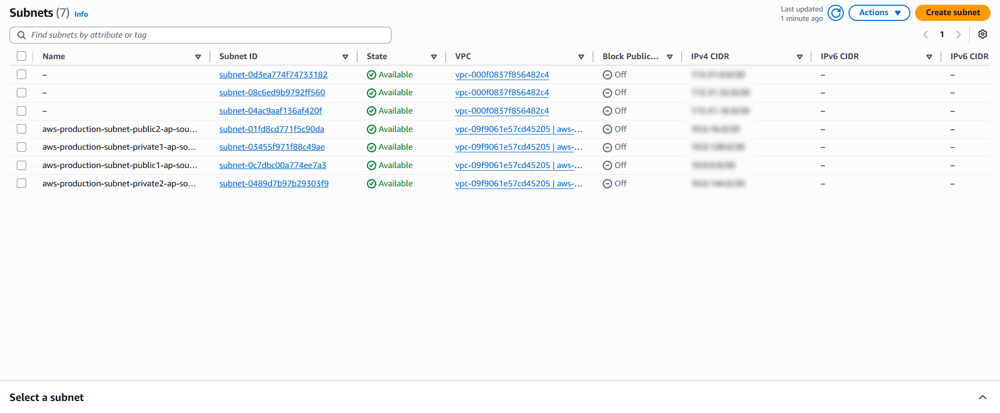

### Route tables
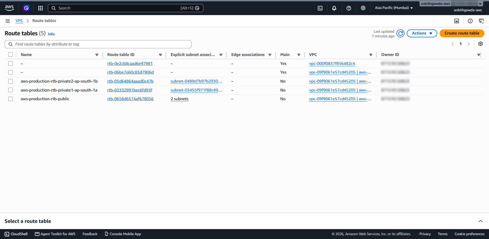

### NAT gateways
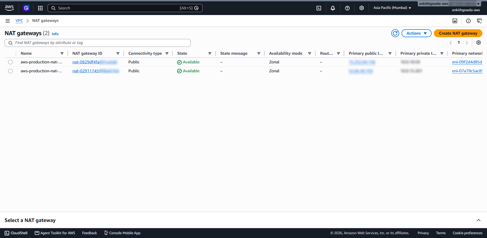

### Security groups
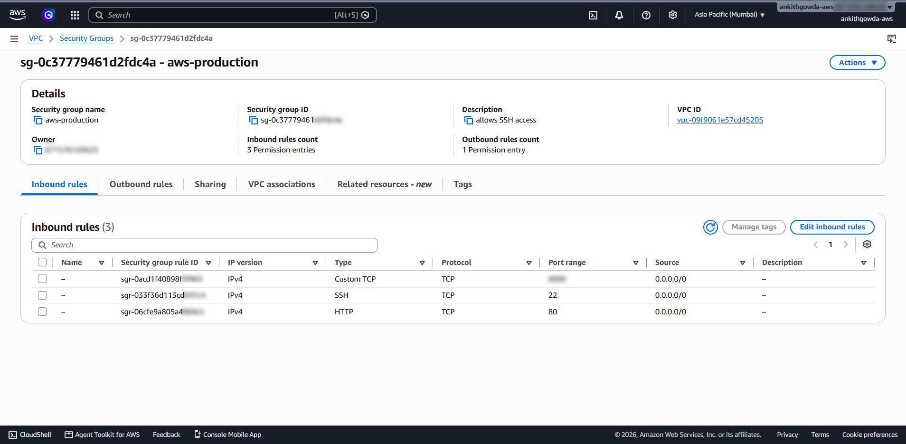

### Auto Scaling Group
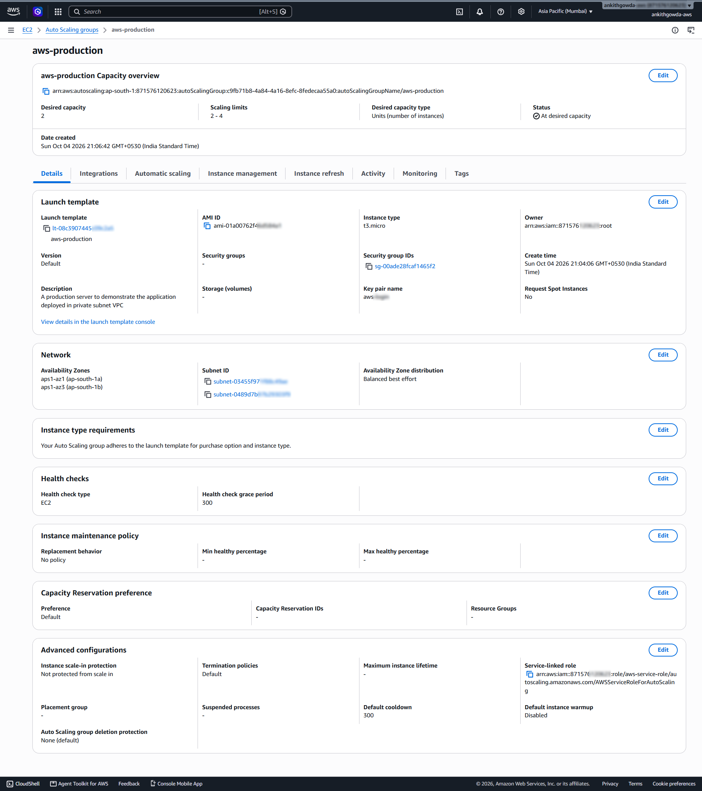

### Load balancer
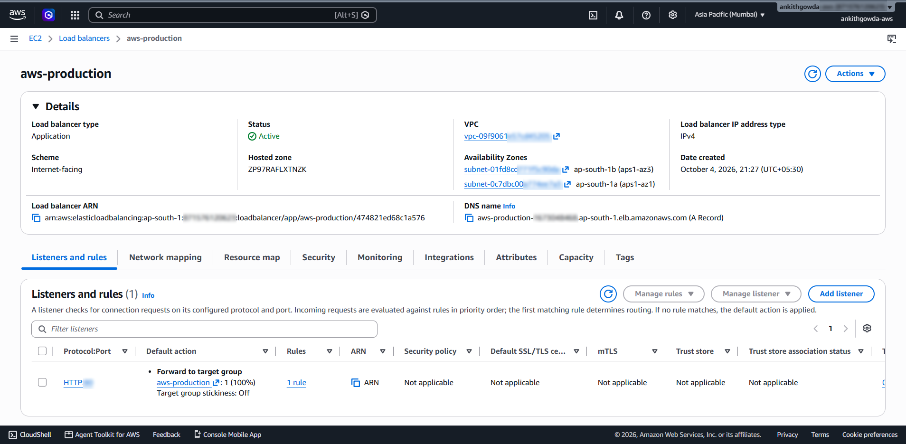

### Target group (2 of 2 healthy)
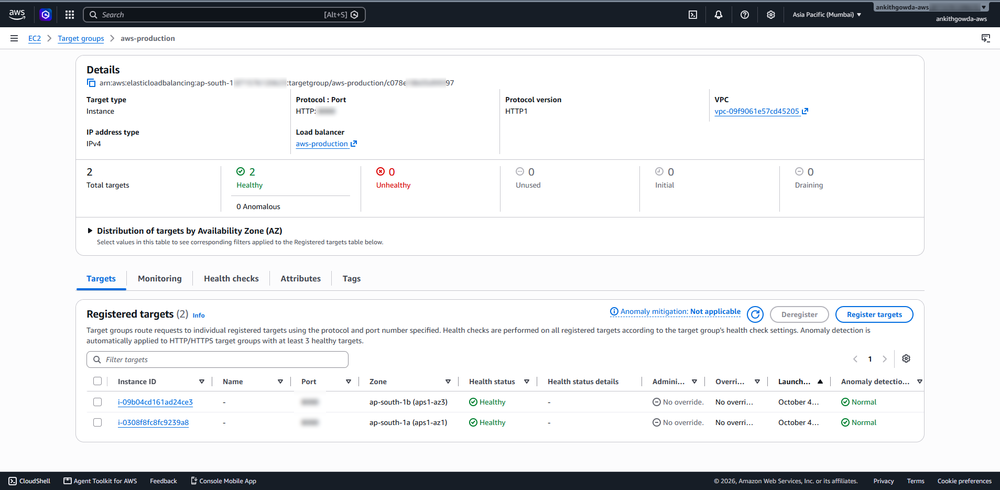

### Application on instance 1
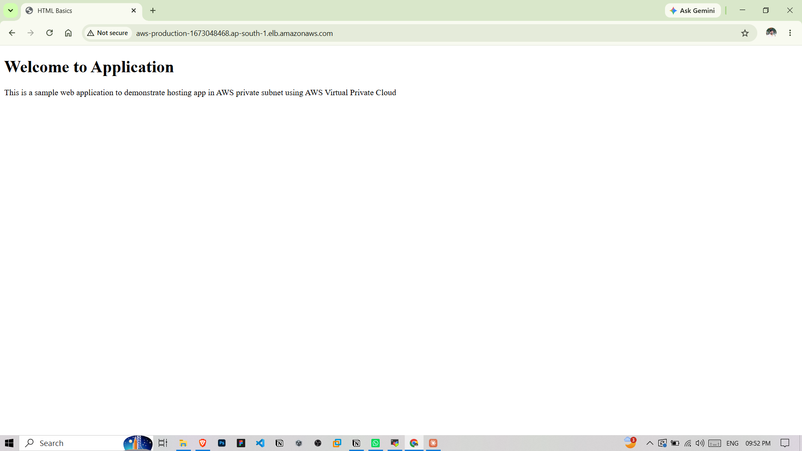

### Application on instance 2
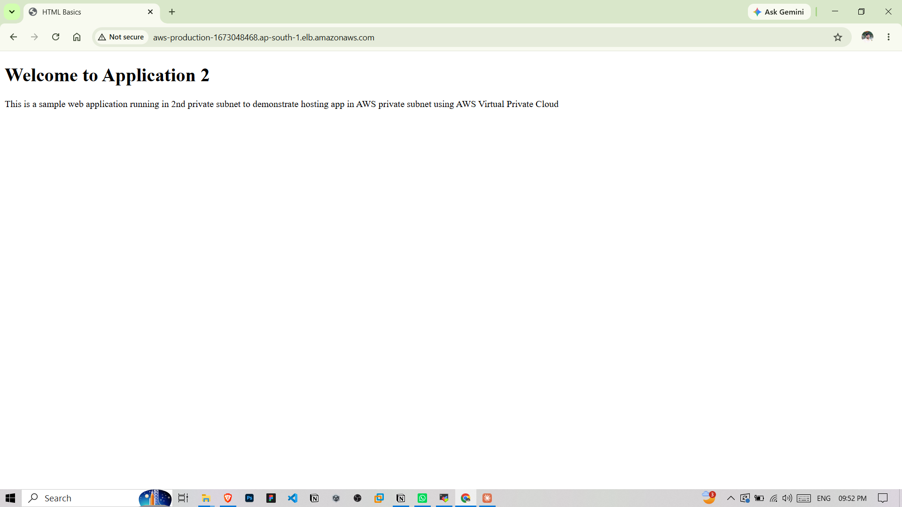

### Server logs
Both servers log a `GET /` with status 200 every 30 seconds from 10.0.14.187 and 10.0.26.167. These are the ALB nodes in the public subnets, running health checks.

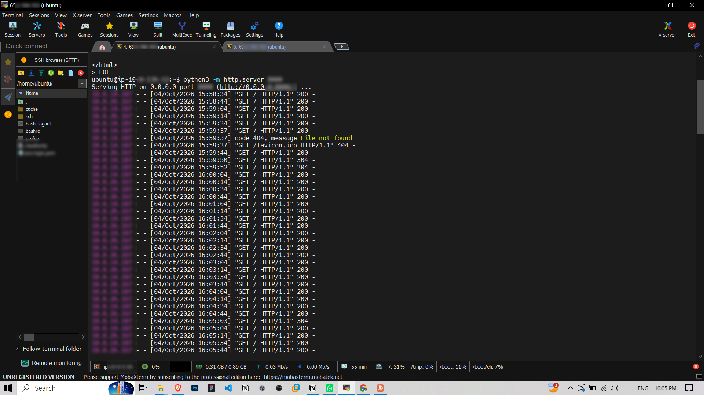
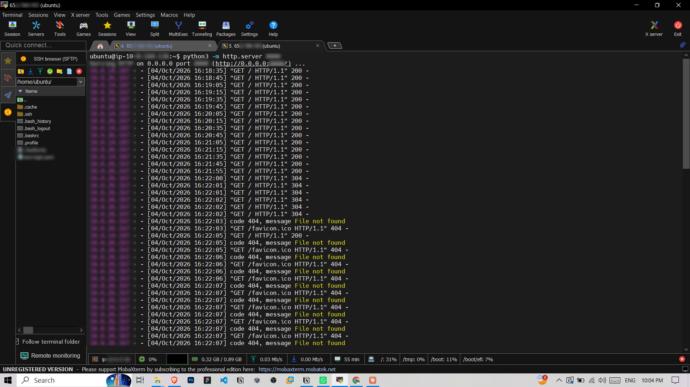

<!-- ## Troubleshooting

### Problem: targets showed Unhealthy in the target group

**Symptom:** [describe what you saw, for example "ALB DNS returned 502 / 504 and the target group showed 0 healthy targets"]

**Cause:** [write your actual cause]

**Fix:** [write what you changed] -->

**Checks I used:**

| Check | Where |
|---|---|
| Is the Python server running on port 8000? | SSH into the instance, run `ss -tlnp \| grep 8000` |
| Does the instance security group allow port 8000 from the ALB? | EC2, Security Groups, Inbound rules |
| Does the ALB security group allow port 80 from the internet? | EC2, Security Groups, Inbound rules |
| Does the health check use the same port as the app? | Target group, Health checks tab |
| Are the ALB subnets public and the instance subnets private? | VPC, Route tables |

### Problem: browser times out on the ALB URL

The ALB security group has no inbound rule for HTTP 80. Add HTTP 80 from `0.0.0.0/0` and refresh.

## Security notes and what I would change for real production

- **Restrict port 8000.** The instance security group should allow port 8000 only from the ALB security group, not from `0.0.0.0/0`.
- **Restrict SSH.** Allow port 22 only from my IP, or use AWS Systems Manager Session Manager and remove the bastion host.
- **Add HTTPS.** Request a certificate in AWS Certificate Manager and add an HTTPS:443 listener on the ALB.
- **Use a real web server.** Python `http.server` is for demos. Use Nginx or an application server.
- **Add ASG scaling policies.** Right now the group holds 2 to 4 instances, but no policy adds instances under load. A CPU target tracking policy would do that.
- **Use ELB health checks in the ASG.** The ASG currently uses EC2 health checks. Switching to ELB health checks lets it replace an instance that is running but not serving traffic.
- **Cost.** 2 NAT Gateways cost money every hour. A single NAT Gateway is cheaper but loses AZ redundancy.

## Clean up

To avoid charges, delete in this order:

1. Auto Scaling Group
2. Load balancer and target group
3. Bastion host
4. NAT Gateways, then release the Elastic IPs
5. VPC (this removes subnets, route tables and the Internet Gateway)

## Skills shown

Amazon VPC, subnets and route tables, Internet Gateway, NAT Gateway, security groups, EC2, Auto Scaling, Application Load Balancer, target groups and health checks, Linux and SSH.
